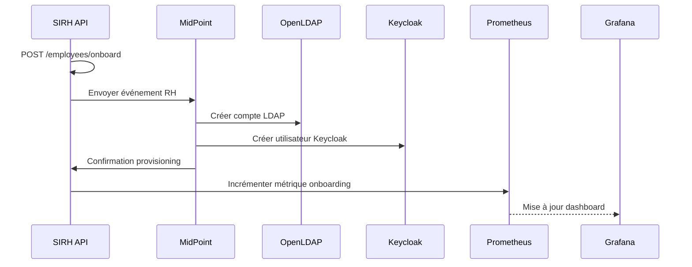
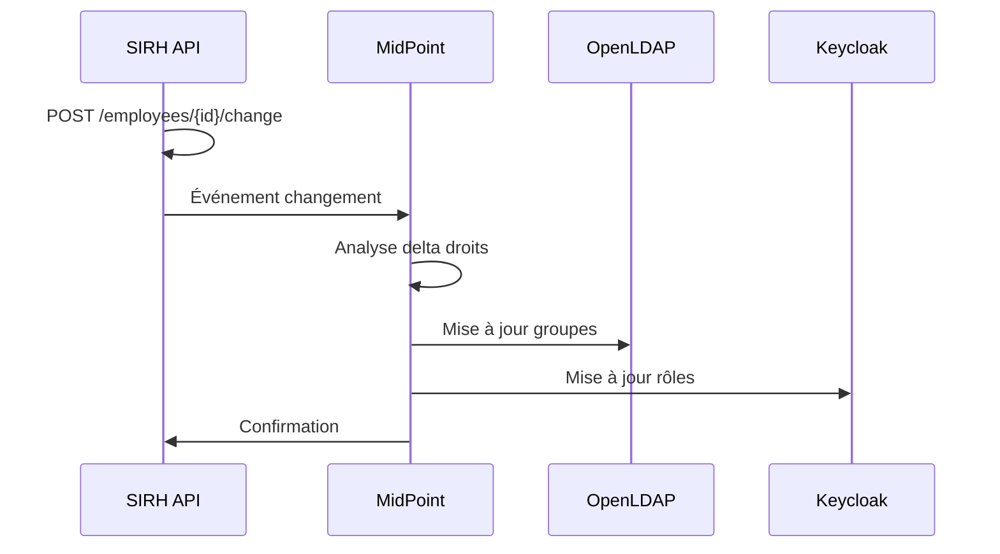
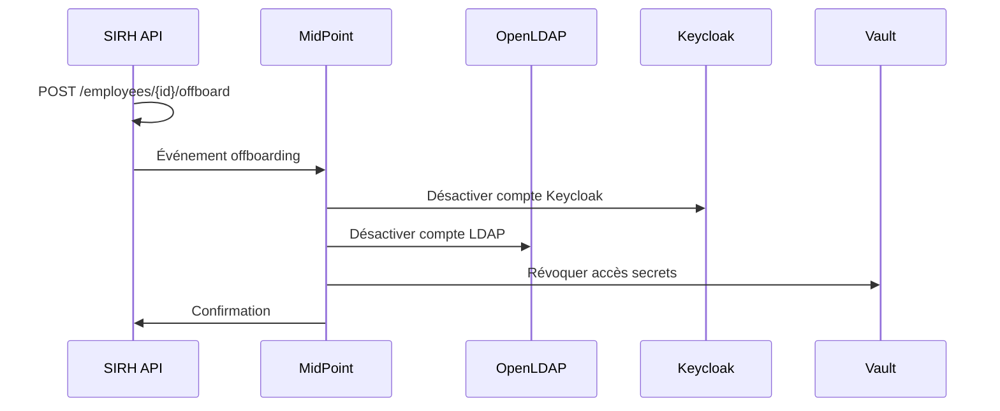

# Architecture IAM 360°

## Vue d'ensemble

La plateforme IAM 360° est conçue autour d'une architecture microservices avec les composants suivants :

### Composants principaux

#### 1. SIRH API (Source de vérité RH)
- **Technologie** : Python FastAPI
- **Rôle** : Point d'entrée pour tous les événements RH
- **Fonctionnalités** :
  - Onboarding automatisé
  - Changements organisationnels
  - Offboarding
  - Métriques Prometheus

#### 2. MidPoint (IGA - Identity Governance & Administration)
- **Technologie** : Evolveum MidPoint 4.8
- **Rôle** : Orchestration centrale des identités
- **Fonctionnalités** :
  - Provisioning vers systèmes cibles
  - Workflows d'approbation
  - Réconciliation
  - Gestion du cycle de vie

#### 3. Keycloak (SSO & Access Management)
- **Technologie** : Keycloak 23.0
- **Rôle** : Authentification et autorisation centralisées
- **Fonctionnalités** :
  - Single Sign-On (SSO)
  - OAuth2 / OpenID Connect
  - MFA
  - Fédération d'identités

#### 4. OpenLDAP (Annuaire)
- **Technologie** : OpenLDAP 1.5.0
- **Rôle** : Annuaire centralisé
- **Fonctionnalités** :
  - Stockage utilisateurs/groupes
  - Authentification LDAP
  - Hiérarchie organisationnelle

#### 5. HashiCorp Vault (Secrets Management)
- **Technologie** : Vault 1.15
- **Rôle** : Gestion centralisée des secrets
- **Fonctionnalités** :
  - Stockage sécurisé
  - Rotation automatique
  - Accès JIT (Just-In-Time)

#### 6. Monitoring Stack
- **Prometheus** : Collecte de métriques
- **Grafana** : Visualisation et dashboards
- **PostgreSQL** : Base de données partagée

## Flux de données

### Onboarding



### Changement organisationnel



### Offboarding



## Architecture réseau

### Environnement local (Docker)

```
Network: 172.28.0.0/16 (iam-network)
├── 172.28.0.10  postgres       (PostgreSQL)
├── 172.28.0.11  midpoint-init  (Init MidPoint)
├── 172.28.0.12  midpoint       (MidPoint)
├── 172.28.0.13  ldap           (OpenLDAP)
├── 172.28.0.14  phpldapadmin   (LDAP Admin)
├── 172.28.0.15  keycloak       (Keycloak)
├── 172.28.0.16  vault          (Vault)
├── 172.28.0.17  redis          (Cache)
├── 172.28.0.18  sirh-api       (SIRH API)
├── 172.28.0.19  prometheus     (Prometheus)
├── 172.28.0.20  grafana        (Grafana)
└── 172.28.0.21  nginx          (Reverse Proxy)
```

### Ports exposés

| Service | Port interne | Port externe | Description |
|---------|-------------|--------------|-------------|
| PostgreSQL | 5432 | 5432 | Base de données |
| MidPoint | 8080 | 8080 | IGA |
| OpenLDAP | 389/636 | 389/636 | LDAP/LDAPS |
| phpLDAPadmin | 80 | 8090 | Admin LDAP |
| Keycloak | 8080 | 8180 | SSO |
| Vault | 8200 | 8200 | Secrets |
| Redis | 6379 | 6379 | Cache |
| SIRH API | 8000 | 8000 | API RH |
| Prometheus | 9090 | 9090 | Métriques |
| Grafana | 3000 | 3000 | Dashboards |
| Nginx | 80/443 | 80/443 | Reverse Proxy |

## Sécurité

### Authentification

1. **Utilisateurs finaux** : Keycloak SSO
2. **Services** : Service accounts + tokens
3. **Admins** : Comptes dédiés + MFA (prod)

### Chiffrement

- **En transit** : TLS 1.3 (production)
- **Au repos** : Chiffrement volumes (production)
- **Secrets** : Vault pour credentials sensibles

### Isolation

- **Réseau** : Network isolation Docker
- **Services** : Principe du moindre privilège
- **Bases de données** : Bases séparées par service

## Scalabilité

### Horizontal scaling (Production)

- **SIRH API** : Stateless, scalable horizontalement
- **MidPoint** : Cluster MidPoint (multi-nodes)
- **Keycloak** : Cluster Keycloak + cache distribué
- **PostgreSQL** : Réplication master-slave
- **Redis** : Redis Cluster / Sentinel

### Vertical scaling

- **PostgreSQL** : Ajuster resources (CPU/RAM)
- **MidPoint** : JVM heap tuning
- **Keycloak** : JVM heap tuning

## Haute disponibilité (Production)

```
┌─────────────────────────────────────────┐
│           Load Balancer (Azure LB)      │
└─────────────┬───────────────────────────┘
              │
    ┌─────────┼─────────┐
    ▼         ▼         ▼
┌────────┐ ┌────────┐ ┌────────┐
│MidPoint│ │MidPoint│ │MidPoint│  (3 nodes)
└────────┘ └────────┘ └────────┘
    │         │         │
    └─────────┼─────────┘
              ▼
    ┌─────────────────┐
    │ PostgreSQL HA   │
    │ (Master/Slave)  │
    └─────────────────┘
```

## Monitoring & Observabilité

### Métriques collectées

- **SIRH API** : Onboarding, Offboarding, Changes (rate/count)
- **MidPoint** : Provisioning tasks, sync status
- **Keycloak** : Authentications, sessions actives
- **PostgreSQL** : Connexions, queries, performance
- **System** : CPU, RAM, Disk, Network

### Dashboards Grafana

1. **IAM Overview** : Vue d'ensemble des événements RH
2. **System Health** : Santé des services
3. **Performance** : Latence, throughput
4. **Security** : Failed logins, suspicious activities

### Alerting

- **Prometheus Alertmanager** pour les alertes critiques
- **Notifications** : Email, Slack, Teams
- **Conditions** :
  - Service down
  - High latency (> 5s)
  - Failed provisioning
  - Database connections exhausted

## Backup & Recovery

### Stratégie de backup

- **PostgreSQL** : Daily full + WAL archiving
- **LDAP** : Daily slapcat export
- **Configurations** : Git versioning
- **Secrets** : Vault backup encrypted

### RTO / RPO

- **RTO** (Recovery Time Objective) : < 1 hour
- **RPO** (Recovery Point Objective) : < 15 minutes

## Environnements

### Local (Docker Compose)
- Développement rapide
- Tests fonctionnels
- Démos

### Cloud Dev (AKS/EKS)
- Tests d'intégration
- Pre-production
- Load testing

### Production (AKS/EKS)
- Haute disponibilité
- Monitoring avancé
- Backup automatisé
- DR (Disaster Recovery)

## Technologies & versions

| Composant | Version | Notes |
|-----------|---------|-------|
| MidPoint | 4.8 | LTS |
| Keycloak | 23.0 | Latest stable |
| PostgreSQL | 16 | Alpine |
| OpenLDAP | 1.5.0 | |
| Vault | 1.15 | |
| Redis | 7 | Alpine |
| Python | 3.11 | Slim |
| Prometheus | Latest | |
| Grafana | Latest | |
| Nginx | Alpine | |

## Références

- [MidPoint Documentation](https://docs.evolveum.com/midpoint/)
- [Keycloak Documentation](https://www.keycloak.org/documentation)
- [Vault Documentation](https://www.vaultproject.io/docs)
- [OpenLDAP Documentation](https://www.openldap.org/doc/)
